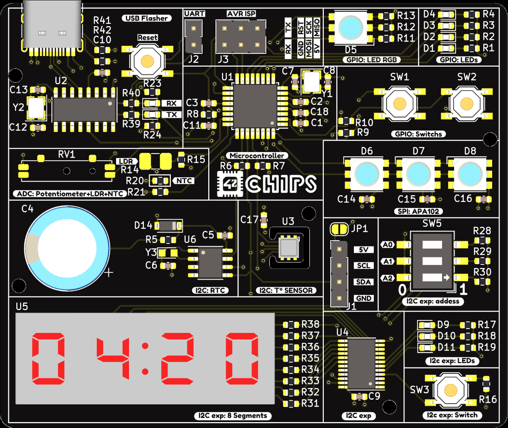
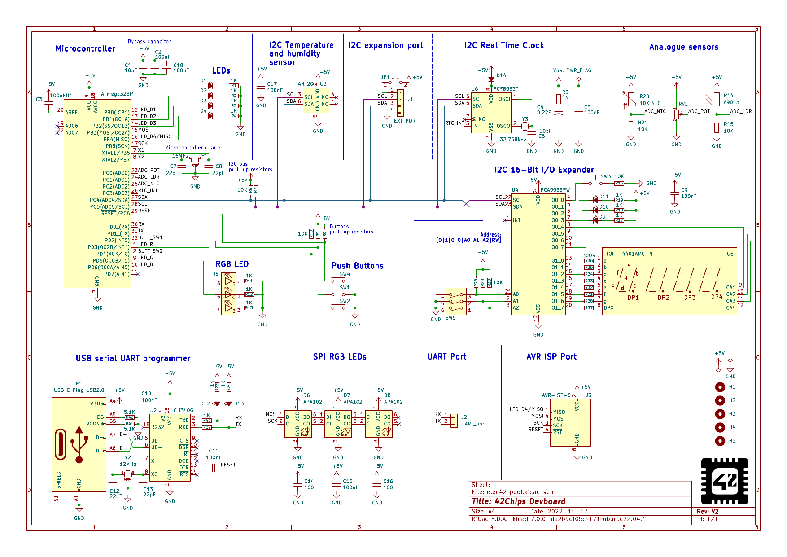

# Embedded Pool

## Project Overview

**Embedded Pool** is an intensive project aimed at learning embedded programming using a development board created by 42Chips featuring an [ATmega328P](https://ww1.microchip.com/downloads/en/DeviceDoc/ATmega48A-PA-88A-PA-168A-PA-328-P-DS-DS40002061A.pdf) microcontroller. This project, which spans over two weeks, involves studying official documentation of the microcontroller and various peripherals, understanding the schematics of the board, and mastering several communication protocols.

Each day, we focused on a new aspect of the development board, culminating in weekend rush projects that required quick thinking and teamwork. This README provides a detailed overview of the project, what was learned each day, and the overall objectives achieved.

  
  

## Learning Outcomes

Through the **Embedded Pool** project, I enhanced my skills in the following areas:

- **C Language Proficiency**: Improved understanding and practical application.
- **AVR Microcontroller Development**: Building and flashing code for the ATmega328P.
- **Microcontroller Functionality**: Insight into how microcontrollers operate and communicate using protocols like UART, I²C, and SPI.
- **Teamwork**: Significant improvement in collaboration and teamwork.
- **Bitwise Operators**: Real application and understanding of bitwise operations.

## Daily Learning Breakdown

### [Day 00](./day00): First Programs
- **Objective**: Create a Makefile and write a program to blink an LED every second.
- **Skills Learned**: Basic setup, Makefile creation, simple LED control.
- **Disclaimer**: This day was not implemented in this repository.

### [Day 01](./day01): Timers
- **Objective**: Utilize the internal timer of the ATmega328P to control an LED.
- **Skills Learned**: Timer configuration, precise timing operations.
- **Disclaimer**: This day was not implemented in this repository.

### [Day 02](./day02): Interruptions
- **Objective**: Implement interrupt routines for buttons and timers.
- **Skills Learned**: Interrupt Service Routines (ISRs), handling external and timer interrupts.

### [Day 03](./day03): UART Protocol
- **Objective**: Enable communication between the microcontroller and a computer via UART.
- **Skills Learned**: Serial communication, UART configuration.

### [Day 04](./day04): I2C Protocol
- **Objective**: Read ambient temperature from the [AHT20](http://www.aosong.com/userfiles/files/media/Data%20Sheet%20AHT20.pdf) sensor using I2C.
- **Skills Learned**: I2C protocol, interfacing with sensors.

### [Rush 00](./rush00): Multiplayer
- **Objective**: Create a speed game where two microcontrollers communicate using I2C.
- **Skills Learned**: I2C communication between microcontrollers, game logic implementation.

### [Day 05](./day05): EEPROM
- **Objective**: Use the EEPROM to save data and restore it after a restart.
- **Skills Learned**: EEPROM read/write operations, data persistence.

### [Day 06](./day06): RGB & Advanced Timers
- **Objective**: Display hex colors based on user input or create a rainbow effect.
- **Skills Learned**: Advanced timer usage, RGB LED control.

### [Day 07](./day07): Analog
- **Objective**: Read the output of a potentiometer and the internal microcontroller temperature via ADC ports.
- **Skills Learned**: Analog-to-Digital Conversion (ADC), sensor reading.

### [Day 08](./day08): SPI Protocol
- **Objective**: Learn SPI protocol to control multiple RGB LEDs.
- **Skills Learned**: SPI communication, controlling multiple devices.

### [Day 09](./day09): 7-Segment Display
- **Objective**: Use an I2C 16-Bit I/O Expander ([PCA9555](https://www.ti.com/lit/ds/symlink/pca9555.pdf)) to display the value of the potentiometer.
- **Skills Learned**: Interfacing with I/O expanders, driving a 7-segment display.

### [Rush 01](./rush01): Final Boss
- **Objective**: Combine all learned skills into a single program that can switch modes with a button press (e.g., display temperature, read ADC, light up all RGB LEDs, etc.).
- **Skills Learned**: Integration of various modules, complex program design, mode switching.

## Acknowledgments

A huge thank you to **42Chips** for organizing this project and providing the resources and guidance needed to succeed. Special thanks to my teammates, **@ahmetUz** and **@Nyttep**, for their hard work, collaboration, and positive attitudes throughout the project.

---

Feel free to reach out for any questions or further details about the **Embedded Pool** project. Thank you for reading!

